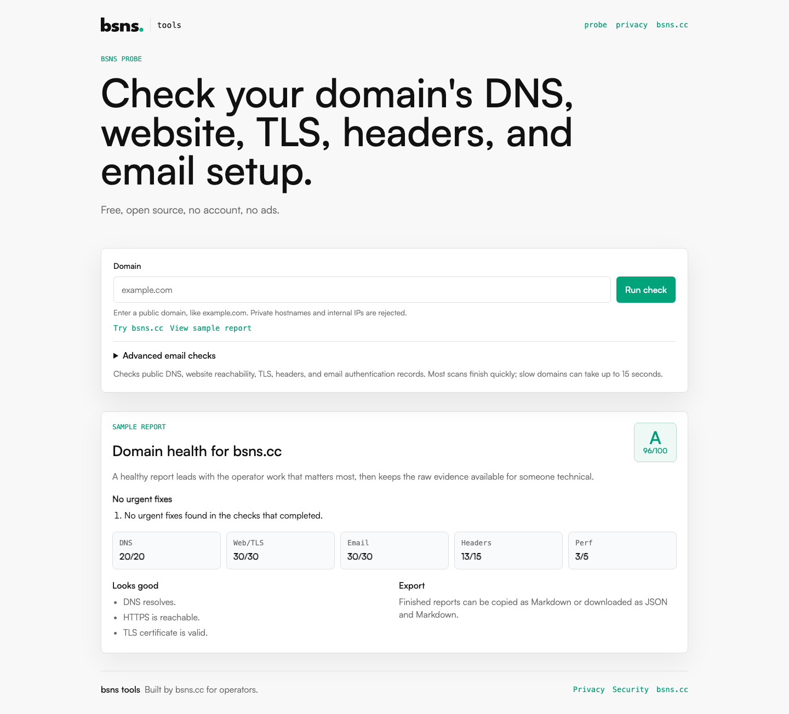
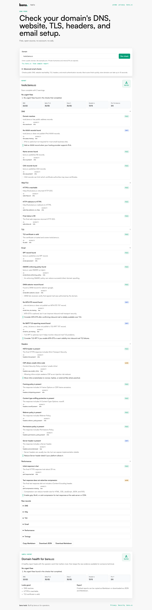

# bsns tools

Free, open-source operational tools for small-business operators.

The first tool is **bsns probe**, a domain health checker for DNS, HTTPS, TLS certificates, HTTP security headers, and email authentication records.

**bsns accessibility** is a second tool: an automated website accessibility check that flags machine-detectable WCAG issues (missing alt text, unlabeled forms, nameless links, blocked zoom, and more) across a page and a few key linked pages, with its own A–F score. It is a starting point, not a compliance certification — see [docs/accessibility.md](docs/accessibility.md).

Hosted app: **https://tools.bsns.cc**

Source: **https://github.com/bsnscc/bsns-probe**

## Why

Most small-business operational problems are boring but costly. The first target is domain health: broken DNS, expiring certs, missing DMARC, weak redirects, or unclear headers. bsns probe gives a plain-English report and exportable fixes.

## Features

- DNS records: A, AAAA, NS, MX, TXT, CAA
- Web reachability and redirects
- TLS certificate expiry and hostname validation
- HTTP security headers
- SPF, DMARC, DKIM selector discovery
- JSON and Markdown reports
- CLI for bsns probe and a web UI at `tools.bsns.cc`
- No account, no ads, no telemetry by default

The shared `@bsns/probe-core` package includes domain input normalization, SSRF/DNS-rebinding guards, DNS checks, web reachability checks, TLS certificate checks, HTTP security header checks, email authentication checks, performance-lite checks, and weighted scoring.

The `@bsns/a11y-core` package provides the accessibility scan (`scanAccessibility`): a static, no-browser checker that reuses probe-core's SSRF-guarded HTTP client, discovers a few key pages, runs WCAG rules with `node-html-parser`, and produces a separately scored `A11yReport`. CLI: `bsns-a11y <url>`.

## Screenshots





## Quick Start

```bash
pnpm install
pnpm test
pnpm typecheck
pnpm lint
pnpm build
pnpm dev
```

The standalone repo includes a GitHub Actions workflow that runs tests, typecheck, lint, and build on pull requests and pushes to `main` or `master`.

## CLI

```bash
pnpm --filter @bsns/probe-cli dev example.com
pnpm --filter @bsns/probe-cli dev example.com --markdown
pnpm --filter @bsns/probe-cli dev example.com --json
pnpm --filter @bsns/probe-cli dev example.com --selectors google,selector1,selector2
```

## Web

```bash
pnpm --filter @bsns/tools-web dev
```

Then open `http://localhost:3000`.

The hosted shape is:

- `tools.bsns.cc` for bsns probe
- `tools.bsns.cc/probe` redirects to `/`
- `tools.bsns.cc/privacy` for the hosted privacy note
- `tools.bsns.cc/security` for vulnerability reporting
- `tools.bsns.cc/api/probe/scan` for the scan API

Internal API example:

```bash
curl -sS https://tools.bsns.cc/api/probe/scan \
  -H 'content-type: application/json' \
  --data '{"domain":"example.com","includeRaw":false}'
```

Production smoke check:

```bash
pnpm smoke:production
pnpm smoke:browser
```

Refresh production screenshots:

```bash
pnpm screenshots:production
```

## Privacy

No account required. On tools.bsns.cc, reports are not stored. The hosted app has no ads and no third-party analytics.

## Security

Please report vulnerabilities to `security@bsns.cc`.

The hosted scanner accepts domain names only. It rejects IP addresses, local/reserved hostnames, custom ports, and DNS answers in private or reserved IP ranges. HTTP redirects are validated before they are followed. HTTP, TLS, and MTA-STS policy fetches use controlled Node networking with vetted public address sets pinned into the connection lookup path.

For self-hosting, keep the scanner isolated from internal networks where possible and configure platform-level rate limiting or WAF rules for the scan API routes. The app includes request body caps, whole-scan timeouts, per-IP best-effort rate limits, and per-runtime active scan backpressure, but those controls are defense in depth rather than a replacement for edge limits.

More detail:

- [Threat model](docs/threat-model.md)
- [Deployment notes](docs/deployment.md)
- [Operations notes](docs/operations.md)
- [Privacy notes](docs/privacy.md)

## License

MIT
